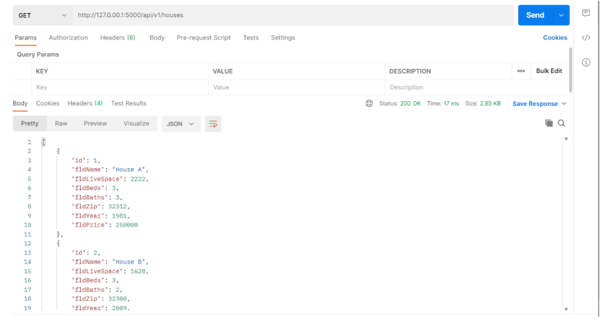
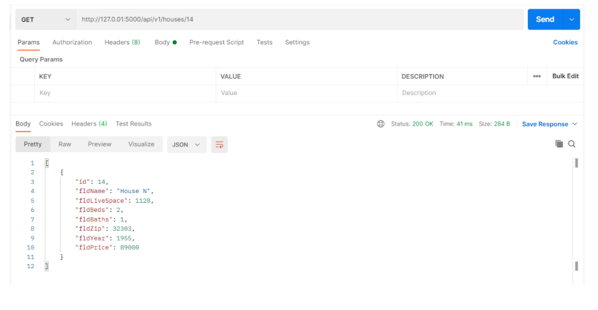
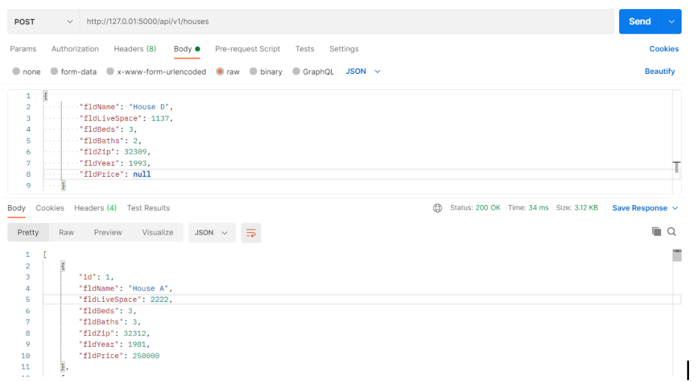
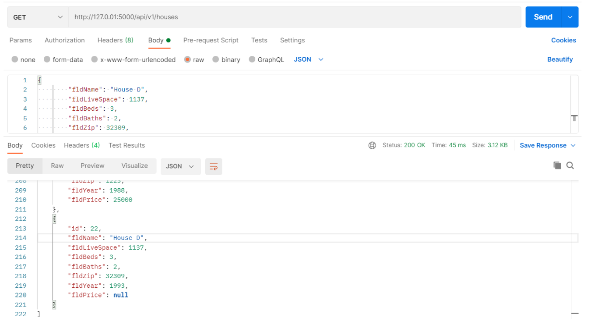
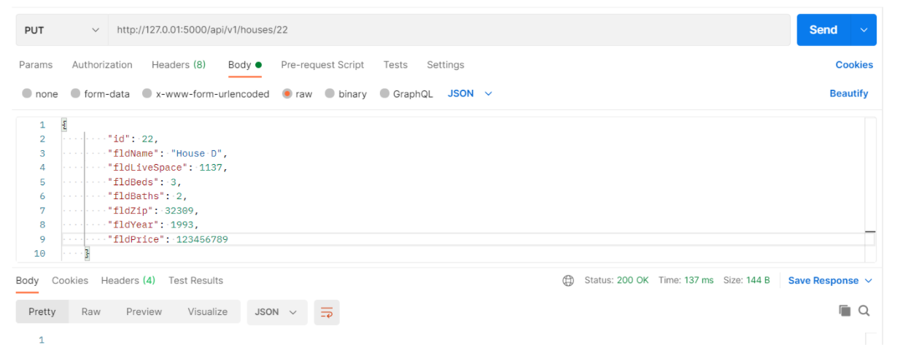
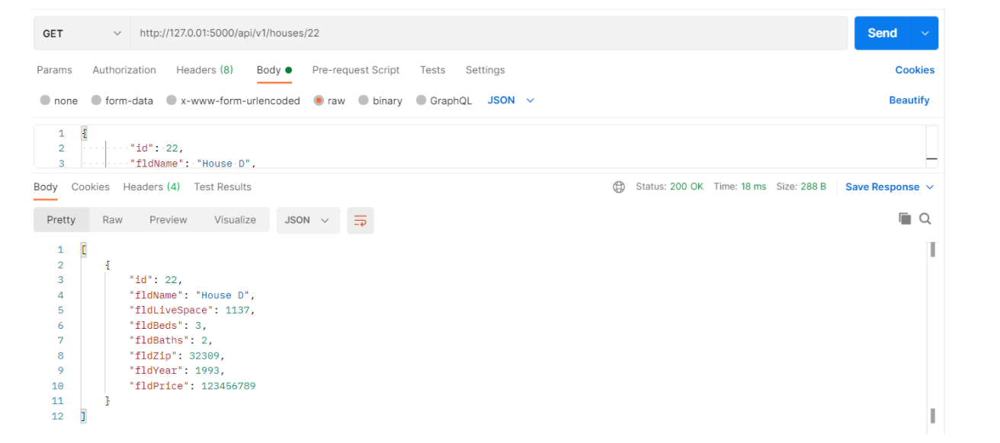
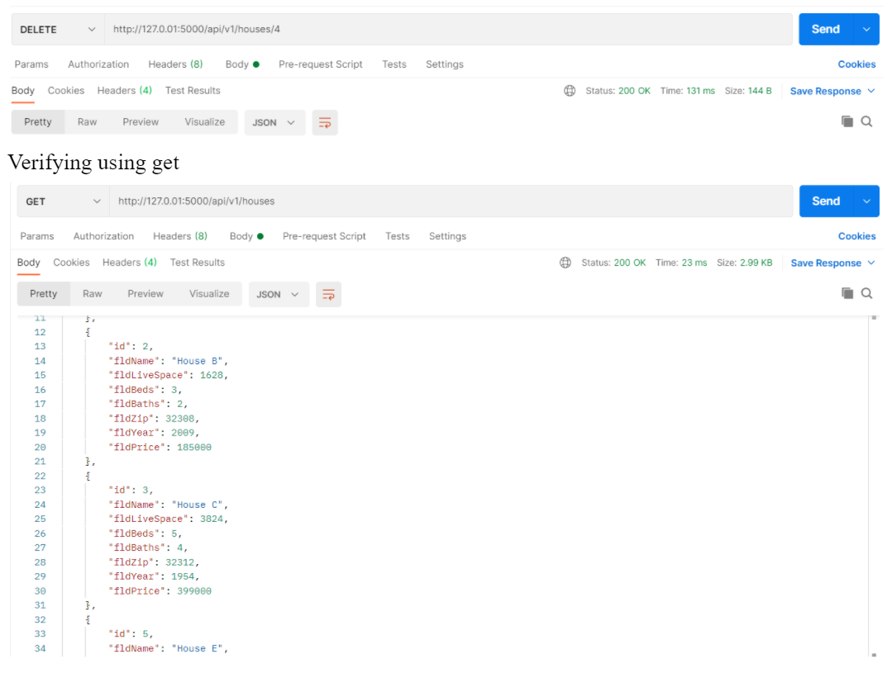

# Final-Individual

This project is a final assignment that utilizes Pycharm setup with Docker, Flask, MySQL, and Postman to host a local host website with data.

## Attached Individual Final Project pdf document for reference on files

## GET Data Screenshot

## One Record Using Get Request Screenshot

## POST request to add new record

## Screenshot to verify post request

## PUT request to edit a record

## Screenshot to verify put request

## Delete Request

